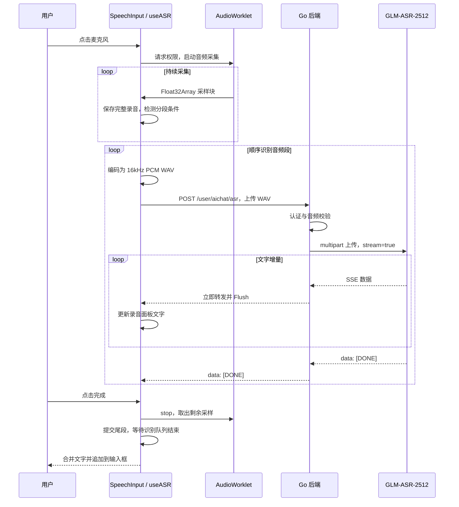

# ASR 语音输入实现详解

本文说明 seekF 当前 AI 聊天页面的 ASR 实现，覆盖前端录音、音频编码、分段识别、后端调用、SSE 解析、状态管理及调试方法。代码采用 **GLM-ASR-2512 + 浏览器 AudioWorklet + 分段音频上传 + SSE 文字返回**。

ASR（Automatic Speech Recognition，自动语音识别）将用户的讲话转换成文字。本项目将识别结果作为聊天输入：录音期间在面板预览文字，点击“完成”后追加到输入框，用户可以编辑后再发送。

## 1. 当前功能与“流式”的含义

当前功能包含两个配合工作的部分：

1. **音频分段提交**：浏览器持续录音，遇到停顿或达到分段上限，将已经采集的音频编码成一个完整 WAV 文件并上传。上传和识别期间，麦克风继续采集后续音频。
2. **文字流式返回**：后端对每个 WAV 文件调用 GLM，设置 `stream=true`，将供应商返回的 SSE 数据逐块转发给浏览器。浏览器收到文字增量就更新预览。

GLM 的音频转写接口接收音频文件，`stream=true` 控制识别文字按事件流返回，事件流以 `data: [DONE]` 结束。当前使用的接口协议见 [Z.AI Audio Transcriptions 官方说明](https://docs.z.ai/api-reference/audio/audio-transcriptions)。

因此，“边说边显示”仍然存在分段等待时间：先采集一个音频段，再上传并等待模型返回。当前实现没有通过 WebSocket 持续向 GLM 上传原始麦克风帧。

| 行为 | 当前实现 |
| --- | --- |
| 录音时显示识别结果 | 支持，在录音面板显示 |
| 识别时继续录音 | 支持，采集与网络请求独立进行 |
| 单次录音上限 | 30 秒，到达上限自动完成 |
| 停顿切段 | 当前段至少 2 秒，且连续静音至少 0.5 秒 |
| 连续讲话切段 | 当前段达到 8 秒时切段 |
| 静音段 | 未检测到有效音量的段不上传 |
| 识别结果回填 | 点击完成并处理完全部音频段后追加到输入框 |
| 识别失败重试 | 保留本次已采集的完整音频，重新整体识别 |
| 取消或切换会话 | 停止录音、取消请求，忽略旧任务结果 |

## 2. 代码位置与职责

本文中的链接均相对于本文件所在目录。

| 文件 | 职责 |
| --- | --- |
| [SpeechInput.vue](../../seekF-user/app/components/SpeechInput.vue) | 麦克风按钮、录音面板、波形、计时、文字预览及完成/取消/重试按钮 |
| [useASR.js](../../seekF-user/app/composables/useASR.js) | 录音状态、麦克风生命周期、分段队列、网络请求、结果合并与重试 |
| [asr-recorder.js](../../seekF-user/public/audio/asr-recorder.js) | AudioWorklet 音频线程采集与批量传递采样 |
| [recordingWav.js](../../seekF-user/app/utils/recordingWav.js) | 将浮点采样重采样并编码为标准 PCM WAV |
| [asrStream.js](../../seekF-user/app/utils/asrStream.js) | 读取 Fetch 响应流、解析 SSE、拼接文字增量 |
| [AI 聊天页面](../../seekF-user/app/pages/aichat/index.vue) | 接收识别文字、追加输入框、限制发送及会话切换时取消录音 |
| [router.go](../internal/router/router.go) | 注册需要认证的 `POST /user/aichat/asr` 接口 |
| [aichat_controller.go](../internal/controllers/user/aichat_controller.go) | 限制上传大小、校验录音、调用服务、实时转发 SSE |
| [aichat_service.go](../internal/services/user_service/aichat_service.go) | 提供 `SpeechToText` 服务方法，委托 ASR 包执行 |
| [asr.go](../internal/pkg/ai/asr/asr.go) | WAV 校验、配置解析、GLM 请求及响应检查 |
| [configs.go](../internal/configs/configs.go) | 读取模型配置，支持环境变量覆盖 |
| [config.toml](../config/config.toml) | 配置 ASR 模型名称 |

## 3. 整体调用流程



图中的采集循环和识别请求可以同时进行。识别请求之间按顺序执行，避免后录制的段先返回而造成文字错序。

## 5. 浏览器如何采集音频

### 5.1 启动顺序

`useASR.start()` 先清理旧任务，然后进入 `starting` 状态：

1. 在用户点击时创建并恢复 `AudioContext`。
2. 调用 `getUserMedia()` 请求麦克风，设置单声道、回声消除及噪声抑制偏好。
3. 保存 `context.sampleRate`，使用浏览器实际采样率，而不是假设麦克风一定输出 16kHz。
4. 加载公共资源 `${config.app.baseURL}audio/asr-recorder.js`。
5. 创建 `MediaStreamAudioSourceNode` 和 `AudioWorkletNode`。
6. 建立音频图并进入 `recording` 状态。

音频图为：

```text
麦克风 MediaStream → MediaStreamAudioSourceNode → AudioWorkletNode → destination
```

Worklet 只读取输入，不写入输出，因此连接到 `destination` 时不会播放麦克风声音。

### 5.2 AudioWorklet 的工作

`ASRRecorder.process(inputs)` 在音频线程中执行。若浏览器提供多个输入声道，逐个采样取声道平均值，得到单声道浮点音频。

Worklet 使用长度为 `2048` 的 `Float32Array` 缓冲。缓冲满后调用 `flush()`，通过 `MessagePort` 将采样块传到主线程，并使用 transferable 转移该采样块的底层 `ArrayBuffer`。

2048 是采样批量大小，不是上传音频段的长度。例如实际采样率为 48kHz 时，一批约为 42.7ms；这些小批次在主线程累计到分段条件后才编码并上传。

用户点击完成时，主线程发送 `stop`。Worklet 会先发送未满 2048 的剩余采样，再发送 `{ done: true }`。主线程最多等待 500ms，随后关闭麦克风，避免漏掉缓冲中的句尾。

## 6. WAV 编码与重采样

`encodeRecordingWav(chunks, sampleRate)` 将一组浮点采样转换为后端接受的格式：

| 参数 | 值 |
| --- | --- |
| 容器 | 标准 WAV，固定 44 字节文件头 |
| 音频编码 | PCM |
| 声道数 | 1 |
| 采样率 | 16000Hz |
| 位深 | 16 位 |
| 字节序 | 小端 |
| 字节率 | 32000 字节/秒 |
| 块对齐 | 2 字节 |

处理步骤如下：

1. 将多个 `Float32Array` 按顺序合并。
2. 根据 `sampleRate / 16000` 计算输入、输出采样之间的对应范围。
3. 对范围内的输入采样取平均，得到目标采样值。
4. 将振幅限制到 `[-1, 1]`，转换为有符号 16 位整数。
5. 写入 `RIFF`、`WAVE`、`fmt `、`data` 等 WAV 文件头字段。
6. 返回 MIME 类型为 `audio/wav` 的 `Blob`。

目标采样数量为 `floor(输入采样数 × 16000 / 实际采样率)`，并限制在 30 秒以内。当前重采样为简单区间平均，后续如需提高音频处理质量，可以在此处替换为更完善的重采样算法。

30 秒文件的最大大小为：

```text
44 + 16000 × 2 × 30 = 960044 字节
```

前后端使用一致的采样格式，后端可以依据文件头、数据长度和文件大小进行严格校验。

## 7. 分段识别与文字合并

### 7.1 完整录音与当前音频段

`useASR` 同时维护两组缓冲：

| 变量 | 用途 |
| --- | --- |
| `chunks`、`sampleCount` | 保留本次完整采样，用于总时长限制与失败重试 |
| `segmentChunks`、`segmentSamples` | 保存尚未提交的当前音频段 |
| `silentSamples` | 统计当前连续静音的采样数量 |
| `segmentHasSpeech` | 标记当前段是否曾达到有效音量阈值 |
| `queue` | 保存已编码、等待识别的 WAV 段 |
| `drainJob` | 当前处理队列的异步任务 |
| `recognizedText` | 已完成识别的音频段文字 |
| `transcript` | 显示在面板中的文字，包含当前段的部分结果 |

### 7.2 停顿检测

对每个采样批次计算 RMS：

```text
RMS = sqrt(所有采样值平方之和 / 采样数量)
```

当 `RMS > 0.003` 时，将当前段标记为有讲话，并将连续静音计数归零；否则累加静音采样数。这是基于音量的简易检测，不是专门的 VAD 模型，环境噪声和说话音量会影响切段。

录音期间，满足任一条件就调用 `enqueueSegment()`：

```js
segmentSamples >= sampleRate * 8
// 或者
segmentSamples >= sampleRate * 2 && silentSamples >= sampleRate * 0.5
```

以实际采样数计算时长，避免定时器调度误差。条件在收到采样批次时检查，因此切段时间可能略超阈值一个采样批次。

有讲话且存在采样的段才进入上传队列，随后清空当前段计数。点击完成时也会提交剩余段，尾段不受 2 秒切段条件限制；整次录音不足 0.3 秒则提示重新录音。

### 7.3 串行队列

`drainQueue()` 每次从队头取一个 WAV，等待其识别完成后再处理下一段。已有 `drainJob` 时复用该任务，避免启动多个消费者。

预览内容的计算方式为：

```text
面板文字 = 已完成段的文字 + 当前段已收到的增量文字
```

当前段结束后将结果纳入 `recognizedText`。拼接两段时，如果边界两侧都是英文字母或数字，则补一个空格；其他情况直接连接。当前没有跨段去重，也没有将上一段文字作为 GLM 的 `prompt` 传入。

## 8. 前后端接口与供应商调用

### 8.1 浏览器请求

本项目接口为：

```http
POST /user/aichat/asr
Accept: text/event-stream
Content-Type: multipart/form-data; boundary=浏览器自动生成
```

表单只有 `file` 字段，上传文件名为 `recording.wav`。模型名称、供应商地址和密钥由后端决定。

```js
const body = new FormData()
body.append('file', blob, 'recording.wav')

const response = await fetch(`${apiBase}/user/aichat/asr`, {
    method: 'POST',
    credentials: 'include',
    headers: { Accept: 'text/event-stream' },
    body,
    signal: requestController.signal,
})
```

使用 `FormData` 时不要手动设置 `Content-Type`，由浏览器添加正确的 boundary。该路由使用项目的 `Auth()` 中间件，前端通过 `credentials: 'include'` 携带登录凭据。

这里采用 Fetch 读取 POST 响应流，可以上传录音并在同一个请求中消费 SSE；不使用页面 AI 回复中常见的 `EventSource` 调用方式。

### 8.2 Controller 的校验

`AIChatController.SpeechToText()` 依次执行：

1. 使用 `http.MaxBytesReader` 限制整个请求体为 `MaxAudioBytes + 64 × 1024`，额外空间用于 multipart 表单开销。
2. 解析 multipart 表单，处理结束时清理其临时资源。
3. 读取 `file`，使用 `io.LimitReader(file, MaxAudioBytes + 1)` 限制音频读取量。
4. 调用 `asr.ValidateRecording()` 校验 WAV。
5. 调用 Service，获取供应商响应流。

`ValidateRecording()` 校验文件大小、固定位置的格式标记、PCM 格式、声道数、采样率、字节率、块对齐、位深，以及 RIFF 和 data 长度与实际字节数是否一致。

这是针对浏览器编码器生成的固定 44 字节头 WAV 的校验。即使供应商支持其他音频格式，本项目入口目前也不接受 MP3、立体声 WAV 或带额外头部块的任意 WAV。

### 8.3 Service 与 ASR 包

Service 的 `SpeechToText(ctx, audio)` 直接委托 `asr.Transcribe()`，不涉及会话 DAO、Kafka、RAG 或 MCP。ASR 只生成输入文字，用户之后发送聊天消息时才进入原有消息处理流程。

`Transcribe()` 再次校验音频，解析模型配置，然后由内部 `transcribe()` 构建供应商请求：

| 请求内容 | 值 |
| --- | --- |
| 方法 | POST |
| 地址 | GLM 基础地址 + `/audio/transcriptions` |
| `Authorization` | `Bearer ` + 服务端 GLM 密钥 |
| `Accept` | `text/event-stream` |
| 表单 `model` | 配置中的 ASR 模型 |
| 表单 `stream` | `true` |
| 表单 `file` | 当前音频段的 WAV |

Go HTTP 客户端超时为 60 秒。代码要求供应商返回 HTTP 200，且 `Content-Type` 以 `text/event-stream` 开头；其他状态或非事件流响应返回中文错误，并关闭响应体。

成功后返回 `StreamResult{Body: res.Body}`，由 Controller 读取并关闭。ASR 包不会先将完整识别响应读入内存再返回。

### 8.4 后端如何实时转发

Controller 获取供应商流后设置：

```http
Content-Type: text/event-stream
Cache-Control: no-cache
X-Accel-Buffering: no
```

随后以 4096 字节缓冲读取供应商响应。每次读到数据都立即写入客户端并执行 `Flush()`。4096 是单次读取的最大缓冲大小，不表示必须凑满 4096 字节才发送。

供应商事件内容原样转发，后端不重新解析并包装文字 JSON。浏览器请求的上下文传入 GLM 请求，客户端取消或断开时，上游请求也会随上下文取消。

## 9. 前端 SSE 解析

`readASRStream()` 负责将网络字节转换为连续文字。关键步骤如下：

1. 检查 HTTP 状态。非成功状态尝试读取 JSON 错误中的 `message`。
2. 检查响应体和 `Content-Type`，确认可以读取事件流。
3. 使用 `response.body.getReader()` 持续读取字节块。
4. 使用 `TextDecoder` 的流式解码保留跨字节块的 UTF-8 字符。
5. 累积不完整的行，按换行拆分，兼容 `\n` 和 `\r\n`。
6. 收集 `data:` 行，遇到空行才解析完整事件；多条 data 行以换行连接。
7. 收到增量后调用 `onText()` 更新预览。
8. 收到结束标记后返回当前音频段的完整文字。

HTTP 数据块不一定对应一个 SSE 事件，也不一定对应一个完整中文字符。因此不能直接对每个 `reader.read()` 的结果调用 `JSON.parse()`。

### 9.1 兼容的文字事件

当前解析器按顺序尝试以下增量字段：

```text
data.delta（字符串）
data.choices[0].delta.content
data.choices[0].delta.text
data.text
```

下面是说明解析过程的示意数据，不代表供应商只会使用这一种结构：

```text
data: {"choices":[{"delta":{"content":"你好"}}]}

data: {"choices":[{"delta":{"content":"，帮我查一下天气"}}]}

data: [DONE]

```

第一条事件后预览为“你好”，第二条后为“你好，帮我查一下天气”，最后返回该段文字。

对于 `type` 以 `.done` 结尾的事件，解析器将其视为结束事件；若包含字符串 `text`，用完整文字校准当前段结果，而不是再次追加。普通增量按原文追加，不合并重复词语，以免破坏用户实际说出的重复内容。

### 9.2 结束和异常

解析器识别 `data: [DONE]`。如果网络流直接结束且没有识别到结束标记，则提示“语音识别连接中断，请重试”，不将未完成响应误认为成功。

包含 `error` 的事件会抛出错误；无效 JSON、非事件流响应及未消费事件缓冲超过 `1024 × 1024` 的长度阈值也会报错。读取结束或失败时，取消 reader 并释放锁。

这个长度阈值约束的是待解析的字符串缓冲，不是音频大小，也不是整次识别文字总长度。

## 10. 状态管理与页面交互

| 状态 | 含义 | 主要后续状态 |
| --- | --- | --- |
| `idle` | 未录音，或已成功回填/取消 | `starting` |
| `starting` | 请求权限并准备音频图 | `recording`、`error`、`idle` |
| `recording` | 持续采集，可在后台识别已提交段 | `transcribing`、`error`、`idle` |
| `transcribing` | 录音已停止，等待队列完成或执行整体重试 | `idle`、`error` |
| `error` | 展示错误，视情况支持重试 | `transcribing`、`starting`、`idle` |

`busy` 在 `starting`、`recording`、`transcribing` 时为 true。`SpeechInput` 将其同步发送给父页面，页面同时在发送按钮和 `sendMessage()` 中检查 `voiceBusy`，防止尚未完成语音输入时发送消息。

AI 回复正在流式生成时，页面通过 `disabled` 禁用新的语音录制。

### 10.1 点击完成

`finish()` 的主要顺序为：

1. 切换为 `transcribing`，防止重复完成操作。
2. 通知 Worklet 停止并等待最后一批采样。
3. 释放麦克风和音频图。
4. 检查整次录音至少为 0.3 秒。
5. 编码并保留完整录音，供异常时重试。
6. 提交剩余音频段，等待识别队列结束。
7. 检查合并结果非空，清理缓存并回到 `idle`。
8. 调用 `onText()`，由组件发出 `transcript` 事件。

父页面的 `appendVoiceText()` 将识别文字追加到已有输入末尾；已有内容末尾不是空白时先插入换行。之后调整输入框高度并聚焦。此步骤不自动发送消息，也不覆盖原有输入。

### 10.2 取消与会话隔离

`cancel()` 会增加 `version`，中止当前 Fetch 请求，结束等待 Worklet 的操作，停止音轨、断开节点、关闭 `AudioContext`，并清空音频、队列及预览文字。

每次异步操作保存开始时的版本号。麦克风授权、模块加载或识别响应返回后，只有版本仍相同才更新当前任务。用户取消后才完成的权限请求，也会立即停止其刚获得的音轨。

AI 聊天页面同步监听当前会话 ID，切换时调用组件暴露的 `cancel()`；组件还以会话 ID 作为 `key`，卸载时清理录音。这样旧会话的迟到结果不会追加到新会话输入框。

### 10.3 失败重试

识别失败后，`failRecognition()` 停止录音并清空待处理队列。当已有足够采样时，保留其完整 WAV，设置 `canRetry`，显示“重试识别”。

重试上传本次已采集的**完整录音**，并重新开始文字预览。成功后只回填这一份完整结果，不再拼接失败前的部分文字，因此不会因重试而重复追加。

“重新录音”会清理旧录音，开始新任务。浏览器内存中的录音不会通过当前 ASR 逻辑上传 OSS 或写入数据库。

## 11. 超时、错误与资源释放

| 场景 | 处理方式 |
| --- | --- |
| 浏览器不支持录音能力 | 进入 `error`，提示 HTTPS/localhost 和浏览器要求 |
| 麦克风权限拒绝 | 提示允许使用麦克风后重新录音 |
| 找不到麦克风 | 提示检查设备 |
| 录音时设备断开 | 取消任务，提示重新录音 |
| 上传格式或大小错误 | Controller 在开始 SSE 前返回 HTTP 400 |
| GLM 配置、调用或响应检查失败 | Controller 记录带用户 ID 的中文日志，返回 HTTP 502 |
| SSE 开始后上游读取异常 | 记录中文日志，并尝试发送 `error` 事件 |
| 前端请求超过 65 秒 | AbortController 取消，进入可重试错误流程 |
| SSE 缺少结束标记 | 解析器报告连接中断 |
| 用户主动取消 | 取消请求并使旧版本失效，回到 `idle` |

前端每个音频段独立设置 65 秒超时；后端供应商请求为 60 秒。队列由多个串行请求组成，因此整次完成操作的总耗时可能超过单个请求的超时值。

麦克风资源在完成、取消、失败或组件卸载时释放。上游响应体由 Controller 关闭；上游状态或响应类型检查失败时，由 ASR 包关闭。

## 12. 调试与验证

### 12.1 浏览器检查

登录后进入 AI 聊天页面，打开开发者工具：

1. 点击麦克风并授权，确认出现“正在聆听”和计时。
2. 说话超过 2 秒后停顿至少 0.5 秒，观察 Network 是否出现 `/user/aichat/asr` 请求。
3. 检查请求表单中的 `file` 为 WAV，响应类型为 `text/event-stream`。
4. 确认录音期间面板出现文字，麦克风仍在采集。
5. 点击完成，确认完整文字只追加一次，原有输入保留。
6. 连续讲话超过 8 秒，确认出现后续音频段请求，结果顺序正确。
7. 测试取消、切换会话、断网后重试，以及到达 30 秒后的自动完成。

识别接口从用户输入流程生成文字，不会自动调用聊天消息发送接口。

### 12.2 常见问题

| 现象 | 检查方向 |
| --- | --- |
| 点击后提示环境不支持 | 页面访问方式、浏览器录音 API、AudioWorklet 支持 |
| 麦克风无法启动 | 浏览器与系统权限、输入设备、设备占用、Worklet 资源是否加载成功 |
| 录音开始后暂时没有文字 | 是否尚未满足切段条件，当前段是否被判为静音，前一段是否仍在识别 |
| 长时间等待或返回 502 | GLM 地址、密钥、模型配置、后端到供应商的网络及服务端日志 |
| 文字集中在最后出现 | 上游实际返回节奏、网关缓冲或响应压缩、代理是否允许即时转发 |
| 音量很小导致没有结果 | RMS 阈值为 0.003，检查输入音量及噪声抑制效果 |
| 分段边界识别不连贯 | 当前没有跨段音频重叠或文字上下文，连续讲话在 8 秒边界可能切开词句 |
| 完成后仍等待 | 录音已停止，但串行识别队列仍在处理剩余音频段 |
| 修改配置后仍未生效 | 是否重启后端，以及非空环境变量是否覆盖 TOML |

后端已发送 `X-Accel-Buffering: no`，部署时仍需检查实际代理配置是否尊重该头，并避免在事件流链路缓存完整响应。

### 12.3 已有验证与范围

开发期间已通过后端 `go build ./...` 和前端 `npm run build`，并使用临时测试验证了 SSE 跨字节块解析、UTF-8、结束标记、错误事件、分段顺序、实时预览、取消与整体重试，以及上游完成前读取到首个事件。

这些验证使用本地模拟音频采样和供应商响应，尚未完成真实麦克风与 GLM 服务的端到端联调。临时测试文件已按 [AGENTS.md](../../AGENTS.md) 的项目规范在验证后删除。

## 13. 扩展时需要同步修改的位置

| 需求 | 主要修改位置 |
| --- | --- |
| 调整停顿和最长切段时间 | `useASR.js` 中的分段条件 |
| 改善静音检测 | `useASR.js` 的 RMS 判定，可考虑专门的 VAD |
| 提高音频编码质量 | `recordingWav.js` 的重采样逻辑 |
| 适配新的文字事件结构 | `asrStream.js` 的 `consumeEvent()` |
| 为分段提供文本上下文或热词 | 扩展前后端参数并修改 `asr.go` 的 multipart 字段；当前未实现 |
| 延长单次录音 | 同步调整前端采样限制、编码上限、后端大小校验及整体重试策略 |
| 接入持续音频上传协议 | 需要支持该协议的供应商接口，并重新设计采集传输与连接生命周期 |

不要只修改界面的“30 秒”文字来延长录音。当前主线程采样截断、WAV 编码器和后端校验都有相应限制，整体重试也依赖本次音频能够在一个请求中提交。
