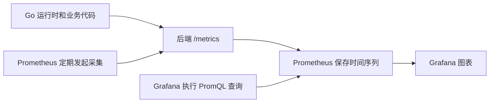

# Prometheus 与 Grafana

本文面向第一次使用 Prometheus 和 Grafana 的开发者，结合 seekF 当前代码，介绍查看指标、创建图表和新增业务指标的完整流程。

文档中的前半部分对应项目已经实现的功能；“新增业务指标”部分是教学示例，尚未加入项目源码。只阅读本文不会自动创建新指标或更改容器配置。

## 1. 先理解这两个工具分别负责什么

假设你想知道后端“最近是否变慢、内存是否持续上涨、哪些接口返回了错误”。应用需要把这些情况变成数值，监控工具才能统计。

| 名称 | 负责什么 | 本项目中的例子 |
| --- | --- | --- |
| 后端指标代码 | 记录或读取当前数值，并通过 HTTP 暴露 | `/metrics` 输出请求次数、协程数量等 |
| Prometheus | 定期读取这些数值，按时间存储，并提供查询 | 每 30 秒采集一次后端 |
| Grafana | 查询 Prometheus，展示图表；配置后也能告警 | “seekF 后端观测”看板 |
| Filebeat、ES、Kibana | 收集、保存和检索日志 | 查看某次失败的详细错误上下文 |

Prometheus 看趋势和数量，Kibana 看具体日志。例如先在 Grafana 发现某时段 5xx 比例上升，再到 Kibana 按相同时间范围查原因。现有 Zap 和日志链路继续使用。



后端不会主动把指标推给 Grafana。Prometheus 主动访问后端，Grafana 再访问 Prometheus。

## 2. 指标、标签和时间序列是什么

### 2.1 一行指标怎么读

后端 `/metrics` 可能输出：

```text
seekf_http_requests_total{method="POST",route="/user/login",status="200"} 120
```

它表示：这个后端进程启动以来，`POST /user/login` 返回 200 的请求累计有 120 次。

- `seekf_http_requests_total`：指标名称。
- `{...}`：标签，用来分类和筛选。
- `120`：当前值。

返回 400 的请求会存入另一组标签：

```text
seekf_http_requests_total{method="POST",route="/user/login",status="400"} 3
```

Prometheus 采集后还会加上来源标签，例如 `job="seekf-backend"`、`instance="host.docker.internal:8080"`。指标名称加上完整标签组合，确定一条时间序列；Prometheus 持续保存该序列在不同时间点的数值。

因此不需要为每个接口创建不同名称的指标，一个请求计数指标配合 `route` 标签就能区分接口。标签过滤的语法见 [Prometheus 查询基础](https://prometheus.io/docs/prometheus/latest/querying/basics/)。

### 2.2 最常用的三种指标类型

| 类型 | 数值特征 | 适用场景 | 常用操作 |
| --- | --- | --- | --- |
| Counter：计数器 | 持续累加，进程重启后重新计数 | 请求次数、失败次数 | `Inc()`、`Add()` |
| Gauge：当前值 | 可增加，也可减少 | 在线人数、内存、队列长度 | `Set()`、`Inc()`、`Dec()` |
| Histogram：直方图 | 将观测值按区间累计 | 请求耗时、文件大小 | `Observe()` |

Counter 的当前值不是 QPS。需要用 `rate()` 计算它每秒增长多少。Gauge 通常直接查询，不要对内存或在线人数使用 `rate()`。

Histogram 会导出多个指标。例如本项目的请求耗时导出：

```text
seekf_http_request_duration_seconds_bucket{...,le="0.1"} 50
seekf_http_request_duration_seconds_sum{...} 18.5
seekf_http_request_duration_seconds_count{...} 100
```

含义分别是：耗时不超过 0.1 秒的请求数、所有请求耗时之和、观测的请求次数。`le` 表示“小于等于”，桶是累计的。Grafana 可以据此计算平均耗时和 P95；P95 是约 95% 请求耗时低于的值，是基于桶估算的结果。[指标类型说明](https://prometheus.io/docs/concepts/metric_types/)

## 3. 本项目已经怎么接入

### 3.1 相关文件

| 文件 | 用途 |
| --- | --- |
| [internal/pkg/observability/registry.go](../internal/pkg/observability/registry.go) | 只持有注册表，统一注册并提供导出处理器 |
| [internal/pkg/observability/metrics/http_metrics.go](../internal/pkg/observability/metrics/http_metrics.go) | 定义HTTP请求次数和耗时指标，提供Record记录方法 |
| [internal/middlewares/http_metrics_middleware.go](../internal/middlewares/http_metrics_middleware.go) | 提取路由、方法、状态和耗时，调用HTTP指标记录方法 |
| [internal/pkg/observability/metrics/websocket_metrics.go](../internal/pkg/observability/metrics/websocket_metrics.go) | 单独定义在线用户业务指标，采集时直接读取 WebSocket 当前人数 |
| [internal/router/router.go](../internal/router/router.go) | 创建 Metrics，安装请求中间件，注册 `/metrics` |
| [internal/services/admin_service/admin_service.go](../internal/services/admin_service/admin_service.go) | 管理端即时运行状态和 Prometheus 就绪探测 |
| [deploy/observability/grafana-dashboard.json](../../deploy/observability/grafana-dashboard.json) | 可手动导入的 Grafana 看板配置 |

真正被容器读取的 Prometheus 配置在 Windows 本地：

```text
D:\develop\docker\docker_data\prometheus\prometheus.yml
```

仓库中不另放一份同名运行配置。`deploy/observability` 保存看板和说明；`internal/pkg/observability` 保存 Go 内部代码。

### 3.2 HTTP 指标怎么自动记录

路由初始化时创建一个 Metrics 实例：

```go
onlineUsersCollector := businessmetrics.NewOnlineUsersCollector()
httpMetrics := businessmetrics.NewHTTPMetrics()
metrics := observability.NewMetrics(
    httpMetrics.RequestsCollector(),
    httpMetrics.DurationCollector(),
    onlineUsersCollector,
)
```

然后安装中间件和导出接口：

```go
r.Use(gin.Logger(), middlewares.HTTPMetricsMiddleware(httpMetrics), gin.Recovery())
r.GET("/metrics", gin.WrapH(metrics.Handler()))
```

请求中间件的关键流程为：

```go
startedAt := time.Now()
c.Next() // 先执行后续中间件和接口处理逻辑。

route := c.FullPath()
if route == "" {
    route = "unmatched"
}
status := c.Writer.Status()

recorder.Record(
    normalizedMethod(c.Request.Method), route, status,
    time.Since(startedAt).Seconds(),
)
```

这段是便于理解的摘录，完整源码还处理了 WebSocket 升级状态和采集接口排除。

中间件的 recorder 参数是一个只要求 Record 方法的接口，实际传入的是上面的 httpMetrics。它内部更新计数器和直方图：

```go
func (m *HTTPMetrics) Record(method, route string, status int, durationSeconds float64) {
    m.requests.WithLabelValues(method, route, strconv.Itoa(status)).Inc()
    m.duration.WithLabelValues(method, route).Observe(durationSeconds)
}
```

HTTPMetrics 与通用 Metrics 是两个不同职责的结构体：HTTPMetrics 持有 requests、duration；通用 Metrics 只持有 registry。注册表导出和中间件更新使用的是同一个 HTTPMetrics 内部的采集器，不会复制计数。中间件通过接口调用它，不直接导入业务指标包。

`c.FullPath()` 是 Gin 注册的路由模板。假设路由为 `/users/:id`，请求 `/users/123` 和 `/users/456` 都记录成 `/users/:id`。未匹配的 URL 统一为 `unmatched`，未知 HTTP 方法归为 `OTHER`，不会把任意路径或用户 ID 变成标签。

指标中间件位于 Recovery 之前，所以异常恢复后返回的 500 也会被计数。`/metrics` 和 pprof 请求不参与请求统计，避免监控自己不断抬高业务请求量。

### 3.3 Go 内存、协程、GC 和进程指标怎么获取

下面两个注册项由官方客户端提供，无需在每个业务函数里埋点：

```go
collectors.NewGoCollector()
collectors.NewProcessCollector(collectors.ProcessCollectorOpts{})
```

- Go 采集器读取 Go 运行时，例如协程数量、堆内存、GC 统计。
- 进程采集器读取当前进程的 CPU、内存等信息，具体可用项取决于平台。
- WebSocket 在线人数在 `internal/pkg/observability/metrics/websocket_metrics.go` 中单独定义。`NewOnlineUsersCollector()` 无需参数，内部通过 GaugeFunc 的回调直接调用 `websocket.ChatServer.OnlineCount()`，采集时读取最新值，并将 int 转成 float64；WebSocket 尚未初始化时返回 0。

`NewMetrics(businessCollectors ...prometheus.Collector)` 接收可选的采集器列表；不传参数时只注册 Go和进程指标。HTTP指标也由路由层明确传入，不再由通用注册表创建。

WebSocket业务指标子包可以直接读取在线状态；WebSocket模块调用 middlewares.MarkWebSocketUpgrade 标记101状态，而中间件仅依赖 Record 接口、不导入业务指标子包，避免 metrics → websocket → middlewares → metrics 的循环依赖。

`NewGaugeFunc` 要求传入 `func() float64`，这是采集时执行的读取函数。该回调保留在采集器内部，调用方无需再传入第二层函数，也不会在初始化时固定保存一个旧人数。

后续业务指标文件集中放在 `internal/pkg/observability/metrics` 子包中，例如 `upload_metrics.go`、`ai_metrics.go`。全进程共享的业务计数可采用全局单例，暴露采集器和记录函数；读取其他业务模块的当前状态时可接收回调，避免循环依赖。新增采集器仍注册到 `/metrics` 使用的同一个注册表，完整示例见第 7 章。

例如 `go_goroutines` 对应当前进程中的协程数量；`go_gc_duration_seconds_count` 是运行时累计的 GC 次数。Prometheus 定期保存累计次数后，可用 `rate()` 计算 GC 频率。[Go 采集器说明](https://pkg.go.dev/github.com/prometheus/client_golang/prometheus/collectors)

### 3.4 已有指标与边界

| 指标 | 能看到什么 |
| --- | --- |
| `up{job="seekf-backend"}` | Prometheus 是否成功采集后端，1 成功、0 失败 |
| `seekf_http_requests_total` | 按方法、路由、状态码分类的请求总数 |
| `seekf_http_request_duration_seconds_*` | 请求耗时分布、平均值和分位数 |
| `seekf_websocket_online_users` | 当前在线用户数 |
| `go_goroutines` | 当前进程协程数 |
| `go_memstats_heap_alloc_bytes` | 当前已分配的 Go 堆内存 |
| `go_gc_duration_seconds_count` | 累计 GC 次数 |
| `go_gc_duration_seconds` | GC 暂停时间的运行时分位数 |
| `process_cpu_seconds_total` | 累计进程 CPU 时间 |
| `process_resident_memory_bytes` | 进程常驻内存，平台不支持时可能没有数据 |

`up` 是 Prometheus 生成的，后端 `/metrics` 中没有它。堆内存、进程内存、Docker 容器内存是不同口径。Go 运行指标属于整个进程，不能用 `route` 标签筛选某个接口的协程或 GC。

请求统计在处理结束后更新。AI SSE 的耗时包含完整生成过程，不是首 Token 延迟；已经返回 HTTP 200 后发生的流内业务错误，不会变成 HTTP 5xx。WebSocket 的 HTTP 指标只涉及握手，在线人数另看在线指标，连接内每条消息尚未单独统计。

管理端当前显示的运行状态直接由后端管理接口读取，历史趋势仍由 Grafana 展示。MySQL 连接探测也不是 Prometheus 的 MySQL 内部指标。当前未采集 Redis、Kafka、ES 内部状态或 AI Token、费用、模型业务成功率。

## 5. 如何查询指标和特定接口

查询可以在 Prometheus 查询页面执行，也可以在 Grafana Explore 中选择 Prometheus 数据源，切换到 Code 模式输入 PromQL。

### 5.1 直接查当前值

```promql
# 当前协程数
go_goroutines{job="seekf-backend"}

# 当前在线人数，汇总所有后端实例
sum(seekf_websocket_online_users{job="seekf-backend"})

# Go 堆内存，换算成 MiB
go_memstats_heap_alloc_bytes{job="seekf-backend"} / 1024 / 1024
```

多实例的在线人数是各实例之和，不跨实例去重。需要看单个实例时增加 `instance="host.docker.internal:8080"`。

### 5.2 查询登录接口

`route` 必须填写后端注册的路由。管理端登录为 `/admin/login`，用户端登录为 `/user/login`。前端开发代理的 `/api` 前缀不进入该标签。

累计登录请求数：

```promql
sum(seekf_http_requests_total{
  job="seekf-backend", route="/user/login", method="POST"
})
```

最近 5 分钟平均 QPS：

```promql
sum(rate(seekf_http_requests_total{
  job="seekf-backend", route="/user/login", method="POST"
}[5m]))
```

最近一小时请求次数的估算：

```promql
sum(increase(seekf_http_requests_total{
  job="seekf-backend", route="/user/login", method="POST"
}[1h]))
```

`rate()` 返回每秒平均增长量，`increase()` 返回时间窗口内增长量。二者会处理 Counter 重置，并对采样窗口进行估算；`increase()` 结果可能是小数，不等于逐条审计日志计数。对 Counter 应先 `rate()`，再 `sum()`。[查询函数说明](https://prometheus.io/docs/prometheus/latest/querying/functions/)

### 5.3 区分状态码和错误率

按状态码查看请求量：

```promql
sum by (status) (
  rate(seekf_http_requests_total{
    job="seekf-backend", route="/user/login"
  }[5m])
)
```

查询全站 HTTP 5xx 比例，排除 WebSocket 握手：

```promql
(sum(rate(seekf_http_requests_total{
  job="seekf-backend", route!="/user/ws/login", status=~"5.."
}[5m])) or vector(0))
/
clamp_min(
  sum(rate(seekf_http_requests_total{
    job="seekf-backend", route!="/user/ws/login"
  }[5m])) or vector(0),
  0.000001
)
```

这里 `status=~"5.."` 匹配 500～599。无失败序列时补 0，无流量时避免除以 0。结果 0.05 代表 5%，Grafana 单位选 Percent (0.0–1.0)，不要再乘 100。该查询也可能在采集失败时显示 0，所以需要配合 `up` 判断。

4xx 通常是参数、认证或权限问题；5xx 是 HTTP 层面的服务端错误。它们都不自动代表 AI 生成或其他业务逻辑的最终成功率。

### 5.4 接口耗时

登录接口的平均耗时，单位秒：

```promql
sum(rate(seekf_http_request_duration_seconds_sum{
  job="seekf-backend", route="/user/login", method="POST"
}[5m]))
/
sum(rate(seekf_http_request_duration_seconds_count{
  job="seekf-backend", route="/user/login", method="POST"
}[5m]))
```

登录接口的 P95：

```promql
histogram_quantile(
  0.95,
  sum by (le) (
    rate(seekf_http_request_duration_seconds_bucket{
      job="seekf-backend", route="/user/login", method="POST"
    }[5m])
  )
)
```

平均值可能掩盖少数慢请求，P95 用于观察尾部耗时。没有请求样本时平均值和 P95 没有有效数据。Histogram 的桶需要覆盖业务耗时范围；本项目包含从 0.01 秒到 900 秒的桶，兼顾普通接口和较长的 AI SSE 请求。

### 5.5 GC 和 CPU

每秒 GC 次数：

```promql
rate(go_gc_duration_seconds_count{job="seekf-backend"}[5m])
```

GC 暂停 P99，单位秒：

```promql
go_gc_duration_seconds{job="seekf-backend", quantile="0.99"}
```

这里 GC 分位数来自 Go 运行时，不是请求耗时的 Histogram。频率增加不一定是故障，需要结合堆内存、CPU 和接口耗时判断。

进程 CPU 使用量：

```promql
rate(process_cpu_seconds_total{job="seekf-backend"}[5m])
```

结果 1 表示使用一个 CPU 核的计算能力，多核时可超过 1。它不是整台电脑 CPU 百分比，也不是 Docker 内存占用。

## 6. 如何新增或修改 Grafana 图表

建议先在界面中完成，再导出 JSON；初学阶段不必手写整个看板。

以新增“协程趋势”图表为例：

1. 打开现有看板，进入编辑模式，选择 Add visualization / 添加可视化。
2. 选择 Prometheus 数据源，在 Code 查询模式输入 `go_goroutines{job="seekf-backend"}`。
3. 可视化类型选 Time series，标题填“协程数量”，单位设为普通数值。
4. 时间范围选择最近一小时，确认出现曲线，再保存图表和看板。
5. 修改已有图表时，从该图表菜单进入 Edit，修改查询、单位或展示类型即可。

常见类型和单位：

| 展示内容 | 图表类型 | 单位 |
| --- | --- | --- |
| 当前在线人数 | Stat | 普通数值 |
| 协程变化 | Time series | 普通数值 |
| 内存变化 | Time series | Bytes |
| 接口耗时 | Time series / Stat | Seconds |
| QPS | Time series / Stat | Requests/sec |
| 0～1 的错误率 | Time series / Stat | Percent (0.0–1.0) |

查询直接返回字节时，选 Bytes 让 Grafana 自动换算显示；若 PromQL 已除以 `1024 / 1024`，应选择 MiB 等相符单位，避免再次误解数值。

项目 JSON 中每个 `panels` 元素是一张图表，核心对应关系如下。这是一个面板的简化片段，不是完整可导入的 Dashboard 文件：

```json
{
  "id": 16,
  "title": "协程数量",
  "type": "timeseries",
  "datasource": {"type": "prometheus", "uid": "${datasource}"},
  "targets": [
    {
      "refId": "A",
      "expr": "go_goroutines{job=~\"$job\",instance=~\"$instance\"}",
      "legendFormat": "{{instance}}"
    }
  ],
  "fieldConfig": {"defaults": {"unit": "short"}},
  "gridPos": {"x": 0, "y": 53, "w": 12, "h": 8}
}
```

`targets[].expr` 决定查哪个指标，`type` 决定图形，`unit` 决定显示单位，`gridPos` 决定布局。`$job`、`$instance` 和 `${datasource}` 来自顶部选择框；`{{instance}}` 是图例模板，不是另一个指标。

项目的一些查询还使用 `$__rate_interval`，这是 Grafana 根据时间跨度和采集间隔计算的窗口。复制到 Prometheus 页面时，它不会自动展开，应改成 `[5m]` 等实际窗口。同样，Prometheus 页面不认识看板的 `$job`、`$instance` 变量，应改成具体值。

保存后从看板的 Export / 导出功能导出 JSON，再更新仓库中的 `deploy/observability/grafana-dashboard.json`。导出选项可能使用实际数据源 UID 或生成数据源占位符；更新时保留模板的数据源选择能力，避免绑定只在自己 Grafana 中存在的 UID。普通导出不会自动把查询改成变量，修改后建议重新导入验证。

## 7. 修改代码：使用全局单例新增上传次数指标

### 7.1 在指标子包中定义单例

新增 `internal/pkg/observability/metrics/upload_metrics.go`，与在线人数指标使用同一个 metrics 包：

```go
package metrics

import (
    "sync"

    "github.com/prometheus/client_golang/prometheus"
)

var (
    uploadOnce    sync.Once
    uploadCounter *prometheus.CounterVec
)

// NewUploadCollector 初始化并返回进程内唯一的普通上传计数器。
func NewUploadCollector() prometheus.Collector {
    uploadOnce.Do(func() {
        uploadCounter = prometheus.NewCounterVec(
            prometheus.CounterOpts{
                Name: "seekf_file_uploads_total",
                Help: "普通文件上传服务调用次数，按成功或失败分类。",
            },
            []string{"result"},
        )
        // 初始化有限标签，使尚未上传时也能导出零值。
        uploadCounter.WithLabelValues("success")
        uploadCounter.WithLabelValues("failure")
    })
    return uploadCounter
}

// RecordFileUpload 根据上传服务的最终结果累计一次计数。
func RecordFileUpload(success bool) {
    // 防止业务记录早于注册执行，确保计数器已完成初始化。
    NewUploadCollector()

    result := "failure"
    if success {
        result = "success"
    }
    uploadCounter.WithLabelValues(result).Inc()
}
```

指标名称为 `seekf_file_uploads_total`，类型是 Counter，标签 result 仅取 success/failure。全局变量使用小写名称，只在 metrics 包内部可见；业务代码通过函数使用它，不直接修改变量。

`sync.Once` 保证整个进程中只初始化一次。多次调用 `NewUploadCollector()` 会返回同一个计数器，不会重新赋值或清空次数。它也保证并发初始化安全；初始化后，Prometheus Counter 自身支持并发更新，不需要给每次 Inc 再加一把锁。

`NewUploadCollector()` 虽然沿用 New 命名，但它的行为是“首次创建、后续返回同一对象”，不是每次创建新实例。进程重启时内存重新初始化，计数从零开始，这是 Counter 的正常行为。

### 7.2 注册和更新为什么是同一份数据

注册表不会复制计数器，它保存的是采集器对象。这里 `NewUploadCollector()` 返回的就是全局 uploadCounter，`RecordFileUpload()` 更新的也是这个变量指向的对象：

```text
RecordFileUpload() ──累计次数──→ uploadCounter
                                      ↑
/metrics ←──注册表读取── NewUploadCollector() 返回同一个对象
```

只要两个函数使用同一份全局计数器，控制器更新后，导出接口就能读到变化。不需要通过 Wire 再传递这个对象。

要区分“全局业务指标对象”和“全局默认注册表”：本方案使用全局 uploadCounter，但依然注册到项目自己的独立注册表。不要调用全局 `prometheus.MustRegister()`，当前 `/metrics` 不读取那个默认注册表。

单例负责保证对象只创建一次，不会自动去重注册。同一个计数器在同一个注册表中只注册一次；重复调用 MustRegister 注册它会触发重复注册错误。

### 7.3 在创建通用注册表时加入上传采集器

在统一创建 `observability.NewMetrics(...)` 的位置增加采集器。以第 3 章的路由初始化方式为例，保留在线人数采集器，再增加上传采集器：

```go
onlineUsersCollector := businessmetrics.NewOnlineUsersCollector()
httpMetrics := businessmetrics.NewHTTPMetrics()

metrics := observability.NewMetrics(
    httpMetrics.RequestsCollector(),
    httpMetrics.DurationCollector(),
    onlineUsersCollector,
    businessmetrics.NewUploadCollector(),
)
```

`businessmetrics` 是 `seekF-backend/internal/pkg/observability/metrics` 的 import 别名。通用构造函数会将传入的采集器注册到同一份 registry，之后由原有 Handler 导出。

这一步修改注册列表即可，不改 `SetupRouter`、`NewFileController` 的构造参数，不新增 FileUploadMetrics 注入字段，也不为这个单例新增 Wire provider。若通用注册表以后迁到其他初始化位置，也应在那里的现有注册列表加入采集器，而不是再创建第二个导出注册表。

### 7.4 在最终业务结果处更新

在 `internal/controllers/user/file_controller.go` 增加业务指标包 import：

```go
businessmetrics "seekF-backend/internal/pkg/observability/metrics"
```

在 `UploadFile()` 中找到实际上传服务调用，紧接着记录：

```go
result, err := c.fileService.UploadFile(ctx, file, fileType)
businessmetrics.RecordFileUpload(err == nil)

if err != nil {
    zlog.Error("文件上传失败: " + err.Error())
    resp.Error(ctx, "文件上传失败", http.StatusInternalServerError)
    return
}

resp.Success(ctx, "文件上传成功", result)
```

`err == nil` 返回 true，记录成功；非 nil 返回 false，记录失败。这个 err 是上传服务的结果，不是前面解析表单的错误。放在错误分支之前，成功和失败都会记录一次，不要在分支内部再重复记录。

本指标统计服务调用结果，不表示文件去重后的数量。请求重试导致服务再次调用时，也会再次计数。若要统计一次完整分片上传，应选择完成上传的业务节点，并明确重试和重复完成请求的口径，不能把每个分片计成一个文件。

### 7.5 编译、重启和验证

在 `seekF-backend` 根目录执行：

```powershell
gofmt -w internal/pkg/observability/metrics/upload_metrics.go internal/router/router.go internal/controllers/user/file_controller.go
go build ./...
```

这个示例没有改变构造函数依赖，不需要运行 Wire 生成命令。编译通过后重启后端，打开 `/metrics`，未上传时也应看到两个零值标签：

```text
seekf_file_uploads_total{result="success"} 0
seekf_file_uploads_total{result="failure"} 0
```

通过用户端执行一次成功的普通文件上传，success 应增加 1；服务调用失败时 failure 应增加 1。未选择文件的请求在参数检查时返回，不增加这两个计数。采集接口只读取计数，不会触发上传。

等待 Prometheus 采集后查询：

```promql
seekf_file_uploads_total{job="seekf-backend"}
```

新增指标仍从原来的 `/metrics` 导出，不需要修改本地 Prometheus 配置、拉取新镜像或重启 Grafana。

全局单例在测试间共享状态，不宜让多个测试都假设初始计数为零。验证时可检查操作前后的计数差值，并确认调用 NewUploadCollector 不会重置数值。若编写临时测试，按项目规范验证后清理，不删除原有测试。

### 7.6 给新指标创建图表

最近一小时失败次数估算：

```promql
sum(increase(seekf_file_uploads_total{
  job="seekf-backend", result="failure"
}[1h]))
```

成功和失败的每秒次数曲线：

```promql
sum by (result) (
  rate(seekf_file_uploads_total{job="seekf-backend"}[5m])
)
```

在 Grafana 新建图表，输入查询并保存。之后导出更新看板 JSON，让其他部署也能复用新图表。

### 7.7 后续新增指标也按这个流程

1. 在 `observability/metrics` 中按业务新增文件，例如 `upload_metrics.go`、`ai_metrics.go`。
2. 为需要全进程共享的业务计数定义单例，提供采集器函数和记录函数。
3. 在通用 Metrics 的创建位置注册采集器一次。
4. 在业务最终结果处调用记录函数，编译并重启后端。
5. 从 `/metrics` 到 Prometheus 查询，再到 Grafana 图表逐步验证。

全局单例更便于业务直接调用，但状态会在整个进程内共享。若以后需要同一进程中的多个独立实例或更严格的测试隔离，可以改为显式注入；这属于另一种设计选择，不是本节新增指标的必要步骤。


## 8. 修改流程和常见问题速查

### 8.1 改什么，就更新什么

| 修改内容 | 要做的操作 |
| --- | --- |
| 新增普通 HTTP 接口 | 现有中间件自动统计，发起请求后验证 route 标签 |
| 新增单例指标或业务埋点 | 注册采集器、调用记录函数、编译并重启后端；本示例无需修改 Wire |
| 修改本地 prometheus.yml | 校验语法、重启 Prometheus 加载配置 |
| 修改 Grafana 查询或单位 | 保存图表和看板，不需要重启容器 |
| 修改仓库看板 JSON | 在 Grafana 重新导入，不会自动同步 |
| 修改 Grafana 数据源地址 | Save & test，不需要改后端业务代码 |

### 8.2 排查顺序

始终按 `/metrics` → Prometheus Targets → Prometheus 查询 → Grafana 数据源 → 图表查询 的顺序排查，前一环不正常时先不要反复修改看板。

| 现象 | 先检查 |
| --- | --- |
| `/metrics` 返回 404 | 是否重启了新后端、是否访问了正确端口和路径 |
| 浏览器能访问但 Targets DOWN | 容器访问的是 host.docker.internal、后端监听地址、防火墙、目标错误信息 |
| Targets UP 但没有请求指标 | 是否实际调用过接口，是否只访问了被排除的 `/metrics` |
| 自定义指标始终没有更新 | 注册表是否一致、实例是否共享、业务记录方法是否被调用 |
| Grafana Save & test 失败 | 数据源 URL 是否能从 Grafana 容器访问、是否误填 localhost |
| Grafana 显示 No data | 数据源、job、instance、route、时间范围、Prometheus 中是否能查到数据 |
| `rate` 查不到数据 | 是否至少有两个采样点、窗口是否足够、序列是否刚创建 |
| 请求量不低但 P95 无数据 | Histogram 是否有对应标签的样本，桶查询和筛选是否正确 |
| QPS 显示 0 | 是否确实无请求，同时检查 up，排除采集失败被补零掩盖 |
| 进程指标没有数据 | 平台是否支持该采集项，不能据此断言进程内存为 0 |

30 秒采集间隔下，建议先使用 `[5m]` 的 rate 窗口。第一次产生一个新标签序列后，需要等待后续采样才能计算增长率；零星请求应结合次数查询，不能只看瞬时 QPS。

补充阅读：[Prometheus 查询基础](https://prometheus.io/docs/prometheus/latest/querying/basics/)、[查询函数](https://prometheus.io/docs/prometheus/latest/querying/functions/)、[Grafana Prometheus 数据源](https://grafana.com/docs/grafana/latest/datasources/prometheus/)。
